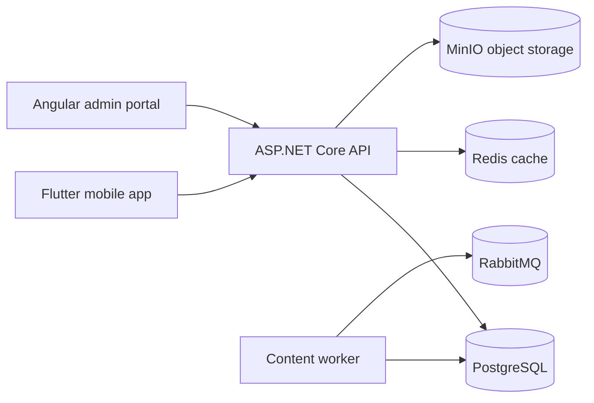

# AppColoreando Architecture

## Layer Contract

Backend follows the mandatory flow:

```text
API Controllers -> Application services -> Application repository ports -> Infrastructure repositories -> EF Core DbContext -> PostgreSQL
```

Logical dependencies:

```text
API -> Application -> Domain
Infrastructure -> Application + Domain
```

Controllers bind HTTP requests, authorize, call one application service and return HTTP results. Domain entities are persistence-agnostic. EF Core, PostgreSQL, seed data, migrations and security token implementations live in Infrastructure.

## C4 Context



## Bounded Areas

- Identity and sessions: local JWT/refresh-token implementation behind ports, designed for later PortalCorporativo adapter replacement.
- Catalog/content: countries, categories, collections, artwork, assets, publishing workflow and licensing rights.
- Coloring/progress: offline progress on mobile, idempotent backend sync with revisions.
- Audit/history/metrics: separate technical audit, functional activity, and reporting metrics tables.

